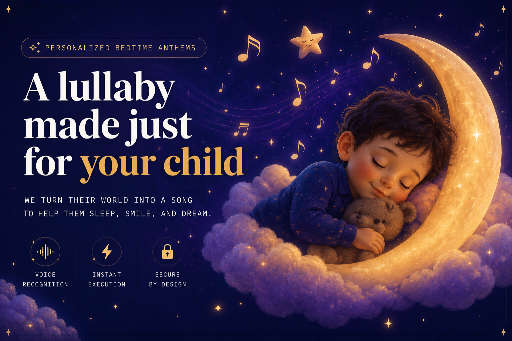

# 🌙 Lullaby — Personalized AI Lullabies for Your Child

<p align="center">
  
</p>

> **One-liner:** Parents describe their child's name, mood, and favorite things — and get a unique, studio-quality lullaby generated in seconds.

[](https://elevenlabs.io)
[](https://stripe.com)
[](https://nextjs.org)

---

## The Problem

Every parent knows the bedtime struggle. Generic lullabies don't calm every child — kids respond to hearing *their own name*, *their favorite animal*, *their mood*. Custom lullabies from musicians cost hundreds of dollars and take weeks. There's no fast, affordable way to get a truly personalized bedtime song.

## The Solution

**Lullaby** generates a one-of-a-kind lullaby in under 2 minutes:

1. Parent fills a simple form — child's name, age, mood, favorite things
2. AI writes personalized lyrics tailored to the child
3. ElevenLabs generates expressive vocal narration and music
4. The tracks are mixed into a polished lullaby delivered via email + in-app library

One strong feature, done well: **a personalized song that makes bedtime magical.**

## Demo

🎬 *[Video link coming soon]*

## How It Works

```
User Input → AI Lyrics (ElevenLabs Agent) → Voice Generation (ElevenLabs TTS)
                                           → Music Generation (ElevenLabs Music API)
                                           → Audio Mixing (FFmpeg) → Delivery
```

### ElevenLabs Integration

- **Conversational AI Agent** — generates personalized lyrics via a pre-configured agent (`gemini-2.5-flash`)
- **Text-to-Speech** — narrates the lullaby with expressive, warm voices from curated presets
- **Music Generation** — creates a unique instrumental track matching the child's mood
- **Multiple voice options** — parents choose from 2–3 curated voice styles

### Tech Stack

| Layer | Technology |
|-------|-----------|
| Framework | Next.js 14 (App Router) |
| Styling | Tailwind CSS |
| Auth | Supabase Auth (magic links) |
| Database | Supabase (PostgreSQL) |
| Payments | Stripe (Checkout, webhooks, one-off + subscription) |
| AI Lyrics | ElevenLabs Conversational Agent |
| Voice | ElevenLabs Text-to-Speech API |
| Music | ElevenLabs Music API |
| Audio Processing | FFmpeg (fluent-ffmpeg) |
| Background Jobs | Inngest |
| Rate Limiting | Upstash Redis |
| Email Delivery | Resend |
| Deployment | Vercel |

## Getting Started

### Prerequisites

- Node.js 18+
- npm
- Supabase project
- ElevenLabs API key
- Stripe account (test mode)

### Installation

```bash
git clone https://github.com/checkra1neth/lullaby.git
cd lullaby
npm install
```

### Environment Variables

```bash
cp .env.local.example .env.local
```

Fill in your keys — see `.env.local.example` for all required variables:

- `ELEVENLABS_API_KEY` — your ElevenLabs API key
- `ELEVENLABS_VOICE_IDS` — JSON array of voice IDs
- `SUPABASE_URL` / `SUPABASE_ANON_KEY` — Supabase credentials
- `STRIPE_SECRET_KEY` — Stripe test key
- `OPENAI_API_KEY` — for lyrics generation fallback

### Run Locally

```bash
npm run dev
```

In a separate terminal, start the Inngest dev server:

```bash
npm run inngest:dev
```

Open [http://localhost:3000](http://localhost:3000).

## Project Structure

```
app/                  → Next.js pages & API routes
  _components/        → Shared UI components
  api/                → Backend endpoints (checkout, preview, webhooks)
  auth/               → Authentication pages
  create/             → Lullaby creation form
  library/            → User's lullaby library
  orders/             → Order status tracking
lib/                  → Core business logic
  elevenlabs/         → ElevenLabs agent integration
  gen/                → Generation pipeline (lyrics → narration → music → mix)
  mood/               → Mood-based theming system
  supabase/           → Database clients
inngest/              → Background job functions
supabase/migrations/  → Database schema
```

## What Makes It Special

- **Real problem, real users** — parents spend real money on personalized children's content
- **Something people will pay for** — clear monetization via one-off purchase and subscription plans through Stripe
- **Deep ElevenLabs integration** — uses Agent API, TTS, and Music generation together in a single pipeline
- **Stripe integration** — secure checkout (one-off + subscription), webhooks, test mode payments
- **Mood-aware UX** — the entire interface adapts colors and animations based on the selected mood
- **Production-ready** — auth, payments, rate limiting, email delivery, background processing

## Built For

[ElevenHacks — Hack #9: Stripe](https://hacks.elevenlabs.io/hackathons/8) — *"Build something people will pay for"*

Built with [ElevenLabs](https://elevenlabs.io) + [Stripe](https://stripe.com)

---

## License

MIT
